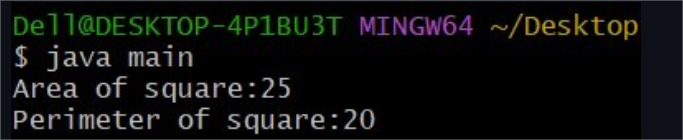

# Expt-2a
```java
class square{
int length;
int areaofsquare(){
return length*length;
}
int perimeterofsqaure(){
retrun 4*length;
}
}
class main{
public static void main(String args[]){
square sq=new square();
sq.length=5;
int area=sq.areaofsquare();
int perimeter=perimeterofsquare();
System.out.println("Area of Square:"+area);
System.out.println("Perimeter of Square:"+perimeter);
}
}
```
#output:



# Expt-2b
```java
class Add{
int add(int a,int b){
return a+b;
}
double add(double a,double b){
return a+b;
}
int add(int a,int b,int c){
return a+b+c;
}
}
class main{
public static void main(String args[]){
Add obj=new Add();
System.out.println("Result of adding two integers:"+obj.add(10,20));
System.out.println("Result of adding two double values:"+obj.add(5.5,6.5));
System.out.println("Result of adding three integers:"+obj.add(40,50,60));
}
}
```
#output:


# Expt-2c
```java
class Student{
String name;
int age;
int marks;
Student(String n,int a,int b){
name=n;
age=a;
marks=m;
}
void display(){
System.out.println("Name:"+name);
System.out.println(Age:"+age);
System.out.println("Marks:"+marks);
}
public static void main(String args[]){
Student s1=new Student("Alice",20,85);
s1.display();
}
}
```
# output:

